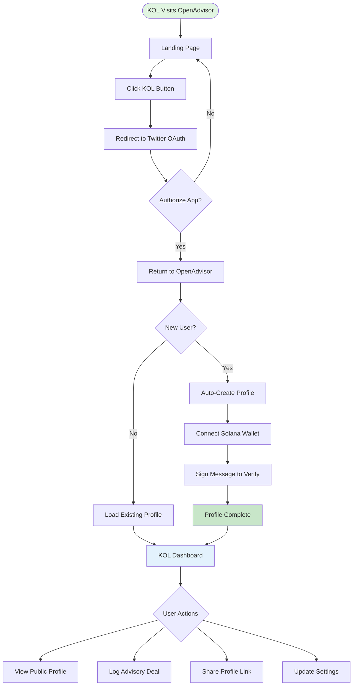

# KOL Onboarding Flow

## Overview

The KOL onboarding process is designed to be as frictionless as possible - taking less than 60 seconds from landing page to complete profile. We use Twitter OAuth as the primary authentication method since all KOLs already have Twitter accounts.

## Visual Flow Diagram

## Detailed Step-by-Step Process

### 1. Landing Page Arrival

**Time: 0-5 seconds**

- KOL arrives at openadvisor.xyz
- Sees clear value proposition: "Make your advisor deals transparent"
- Prominent "I'm a KOL" button above the fold
- Social proof: Leaderboard of verified KOLs

### 2. Twitter Authentication

**Time: 5-15 seconds**

- Click "I'm a KOL" → Redirects to Twitter OAuth
- Standard Twitter app authorization screen
- Permissions requested: Read profile info only
- One-click authorization if already logged into Twitter

### 3. Profile Creation

**Time: 15-30 seconds**

- **New Users**:
  - Profile auto-populated from Twitter (name, bio, avatar)
  - Unique handle generated from Twitter username
  - Option to customize handle if desired
- **Returning Users**:
  - Skip directly to dashboard
  - Session persists for 30 days

### 4. Wallet Verification

**Time: 30-45 seconds**

- Prompt to connect Solana wallet (Phantom, Backpack, etc.)
- Sign a simple message to prove ownership
- Wallet address linked to profile
- Skip option available (can add wallet later)

### 5. Dashboard Access

**Time: 45-60 seconds**

- Welcome message with quick tour
- Empty state encourages first action:
  - Share profile link
  - Log first advisory deal
  - View public profile

## Key UX Principles

### 1. **Minimal Friction**

- No forms to fill out
- All data pulled from Twitter
- Progressive disclosure (wallet optional initially)

### 2. **Immediate Value**

- Public profile created instantly
- Shareable link ready immediately
- Can start receiving recognition right away

### 3. **Trust Building**

- Twitter verification badge shown
- Wallet verification badge (when connected)
- Clear compliance guidelines provided

### 4. **Mobile First**

- Entire flow optimized for mobile
- Large touch targets
- Minimal typing required

## Error Handling

### Twitter OAuth Failures

- Clear error message: "Twitter sign-in hit a snag"
- Retry button prominently displayed
- Alternative: Manual signup option (v2)

### Wallet Connection Issues

- Skip option always available
- Multiple wallet options supported
- Clear instructions for each wallet type

### Network Errors

- Graceful degradation
- Offline functionality where possible
- Auto-retry with exponential backoff

## Success Metrics

### Target KPIs

- **Conversion Rate**: 80% of landing page visitors complete signup
- **Time to Complete**: <60 seconds average
- **Drop-off Rate**: <10% at each step
- **Return Rate**: 70% of KOLs return within 7 days

### Tracking Points

1. Landing page view
2. "I'm a KOL" click
3. Twitter OAuth initiation
4. Twitter OAuth completion
5. Profile creation
6. Wallet connection (optional)
7. First action taken

## Future Enhancements (v2)

### Enhanced Onboarding

- Guided tour of features
- Sample advisory deal to explore
- Compliance tutorial video
- Referral program integration

### Additional Auth Methods

- Email/password option
- Other social logins (Discord, Telegram)
- Multi-wallet support
- Hardware wallet integration

### Profile Enrichment

- Import existing advisory relationships
- LinkedIn verification
- Custom badge system
- Reputation scoring
