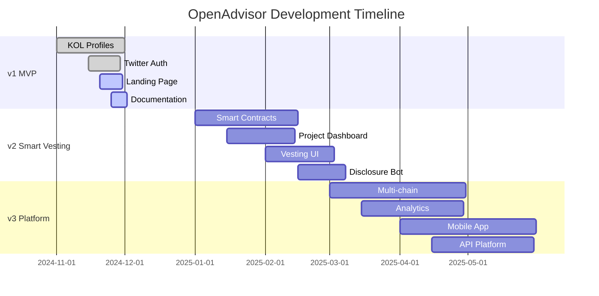

# OpenAdvisor Product Roadmap

## 🎯 Vision

Build the trust layer for crypto advisory relationships by making token grants transparent, compliant, and efficient.

## 📅 Timeline Overview



## 🚀 v1: KOL Transparency (Current - Dec 2024)

### Goal

Get KOLs comfortable with transparency by providing immediate value with minimal friction.

### Core Features

| Feature           | Status         | Description                                 |
| ----------------- | -------------- | ------------------------------------------- |
| Twitter OAuth     | ✅ Done        | One-click signup with Twitter               |
| KOL Profiles      | ✅ Done        | Public pages showing advisor status         |
| Manual Deal Entry | 🔄 In Progress | KOLs can log their advisory relationships   |
| Compliance Guide  | ✅ Done        | Clear FTC/SEC disclosure guidelines         |
| Profile Sharing   | ✅ Done        | Easy social sharing of transparent profiles |
| Leaderboard       | ✅ Done        | Showcase early adopters                     |

### Success Metrics

- 100+ KOLs signed up
- 500+ advisory deals logged
- 10,000+ profile views
- 90% user satisfaction

### Technical Stack

- Next.js 15 + TypeScript
- Tailwind CSS
- PostgreSQL (Supabase)
- Vercel deployment

## 💎 v2: Smart Vesting (Q1 2025)

### Goal

Automate token vesting on Solana with full compliance built-in.

### New Features

| Feature             | Timeline | Description                                    |
| ------------------- | -------- | ---------------------------------------------- |
| Vesting Contracts   | Jan 2025 | Anchor-based smart contracts for token vesting |
| Project Dashboard   | Jan 2025 | Interface for projects to create offers        |
| Deal Flow           | Feb 2025 | KOLs accept/reject offers on-chain             |
| Auto Disclosures    | Feb 2025 | Bot posts disclosures when promoting           |
| Wallet Integration  | Feb 2025 | Deep Phantom/Backpack integration              |
| Email Notifications | Feb 2025 | Deal updates and vesting alerts                |

### Smart Contract Features

```rust
// Core vesting functionality
- Linear vesting schedules
- Cliff periods
- Revocable/irrevocable options
- Multi-token support
- Emergency pause mechanism
- Upgradeable contracts
```

### Integrations

- **Solana Wallets**: Phantom, Backpack, Solflare
- **Twitter API v2**: Automated disclosure posting
- **Helius RPC**: Reliable Solana infrastructure
- **Jupiter**: Token swap integration

### Revenue Model Introduction

- Projects pay 1% of vested tokens as platform fee
- Premium features for KOLs ($49/month)
- No fees for KOLs on standard tier

## 🌐 v3: Full Platform (Q2 2025)

### Goal

Become the default infrastructure for all crypto advisory relationships.

### Advanced Features

| Feature             | Timeline | Description                               |
| ------------------- | -------- | ----------------------------------------- |
| Multi-chain Support | Mar 2025 | Ethereum, Base, Arbitrum support          |
| Analytics Dashboard | Mar 2025 | Performance metrics for KOLs and projects |
| Mobile Apps         | Apr 2025 | iOS and Android native apps               |
| API Platform        | Apr 2025 | Let others build on OpenAdvisor           |
| Deal Negotiation    | May 2025 | In-platform offer/counter-offer flow      |
| Legal Templates     | May 2025 | SAFT/SAFE templates with e-sign           |

### Platform Capabilities

#### For KOLs

- Portfolio analytics across all deals
- Tax reporting exports
- Reputation scoring system
- Private deal rooms
- Custom disclosure templates
- Automated social media management

#### For Projects

- Bulk offer creation
- KOL discovery and filtering
- Campaign performance tracking
- Compliance monitoring
- Treasury management tools
- Investor reporting

#### For Communities

- Real-time transparency feed
- Vesting progress tracking
- Historical deal archive
- Whale watching alerts
- DAO integration tools

### Technical Enhancements

- GraphQL API
- Real-time WebSocket updates
- IPFS for document storage
- Zero-knowledge proof options
- Cross-chain messaging
- Advanced caching layer

## 🔮 Future Vision (2025+)

### v4: AI-Powered Compliance

- Automated disclosure generation
- Sentiment analysis for posts
- Risk scoring for deals
- Predictive compliance alerts

### v5: DeFi Integration

- Liquid vesting positions
- Secondary markets for vested tokens
- Yield strategies during vesting
- Insurance products

### v6: Global Expansion

- Multi-language support
- Jurisdiction-specific compliance
- Local payment methods
- Regional partnerships

## 📊 Key Performance Indicators

### User Growth

| Milestone            | v1 Target | v2 Target | v3 Target |
| -------------------- | --------- | --------- | --------- |
| Total KOLs           | 100       | 1,000     | 10,000    |
| Active Projects      | 0         | 50        | 500       |
| Monthly Active Users | 50        | 500       | 5,000     |
| Total Value Locked   | $0        | $10M      | $100M     |

### Platform Metrics

- **Transaction Volume**: Track total value of vesting contracts
- **Compliance Rate**: % of posts with proper disclosures
- **User Satisfaction**: NPS score > 50
- **Platform Revenue**: $0 → $50k → $500k MRR

## 🛠 Technical Debt & Maintenance

### Ongoing Priorities

1. **Security Audits**: Quarterly smart contract audits
2. **Performance**: <100ms API response times
3. **Reliability**: 99.9% uptime SLA
4. **Scalability**: Support 1M+ users
5. **Compliance**: Regular legal reviews

### Infrastructure Evolution

```
v1: Monolith → v2: Microservices → v3: Edge-first
```

## 🤝 Partnership Strategy

### v1 Partnerships

- Crypto Twitter influencers (advisors)
- Compliance law firms (guidance)
- Web3 communities (distribution)

### v2 Partnerships

- Major Solana projects (first customers)
- Wallet providers (deep integration)
- RPC providers (infrastructure)

### v3 Partnerships

- Traditional advisory platforms
- Accounting software (Quickbooks, etc)
- Regulatory bodies (proactive engagement)

## 💰 Funding & Revenue

### Funding Plan

- **Pre-seed**: $500k (personal + angels)
- **Seed**: $2-3M (Q1 2025)
- **Series A**: $10-15M (Q4 2025)

### Revenue Projections

| Version | Model                   | Monthly Revenue |
| ------- | ----------------------- | --------------- |
| v1      | None (growth focus)     | $0              |
| v2      | Platform fees + Premium | $50k            |
| v3      | Multi-tier SaaS         | $500k           |

## 🎯 North Star Metric

**Transparent Advisory Relationships**: Total number of public, compliant advisory relationships on the platform.

Target progression:

- v1: 500 relationships
- v2: 5,000 relationships
- v3: 50,000 relationships

---

_This roadmap is a living document and will be updated based on user feedback, market conditions, and strategic priorities._
